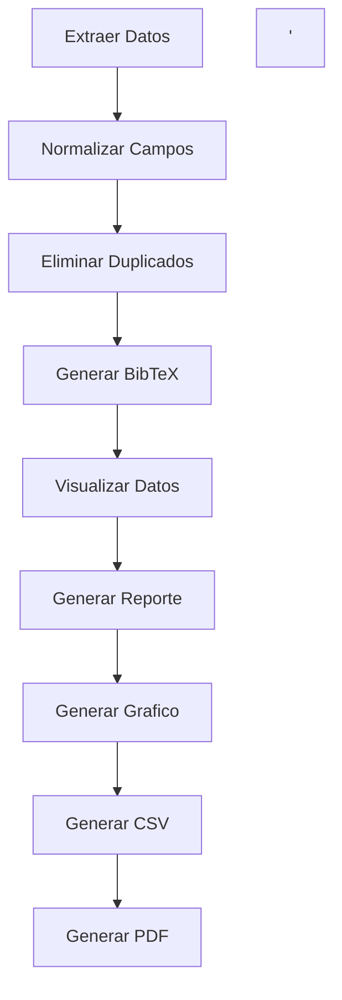

# Guia de Usuario: Proyecto Bibliometria Uniquindio

## Requerimiento 1 : Unificacion de los Datos en Formato RIS o Bibtex

1 . flujo del programa

2. Instalar paquetes 
```bash
pip install requests pandas pybtex matplotlib
```
3. Definir la estructura de directorios
```mermaid  
proyecto_bibliometria/
├── config/
│   └── database_apis.json  # Claves API
├── src/
│   ├── data_fetcher.py     # Extraer datos
│   ├── data_unifier.py     # Unificar y limpiar
│   └── visualizer.py       # Visualización
└── main.py                 # Ejecución principal
```
